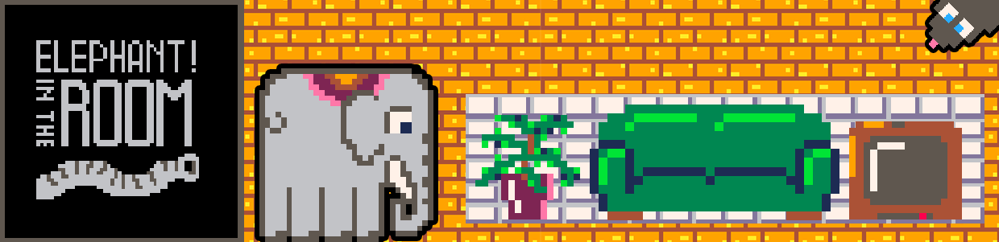
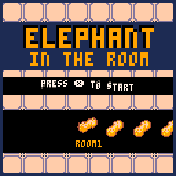
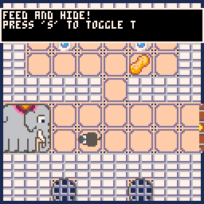
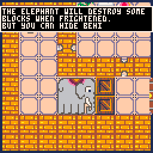

# Elephant In The Room

Small puzzle game created in PICO-8 for [Github Game Off 2022](https://itch.io/jam/game-off-2022). 

This was our the first time with a game jam and with PICO-8 as well. It's written entirely in Lua. Feel free to use our code to your project.

## Screenshots

.png)
.png)
